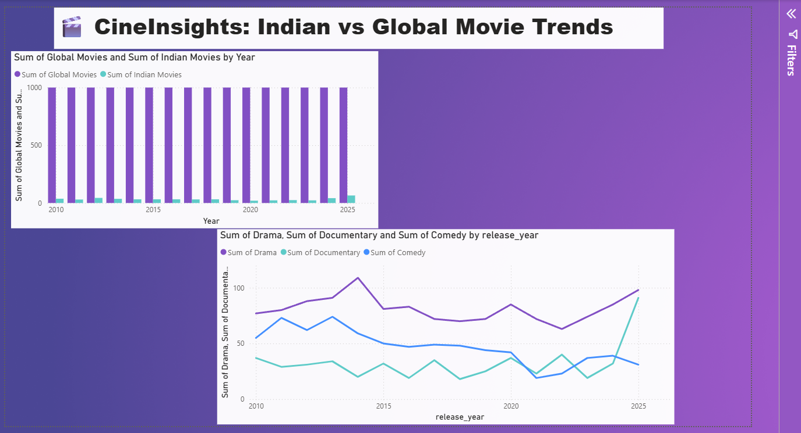
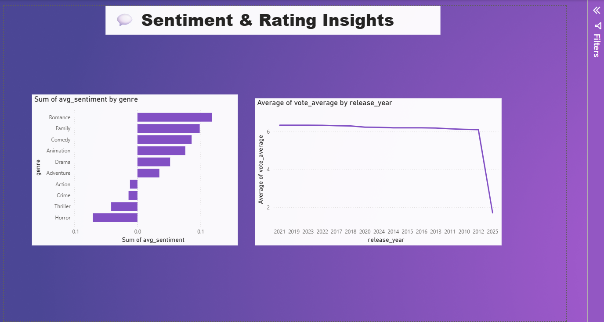
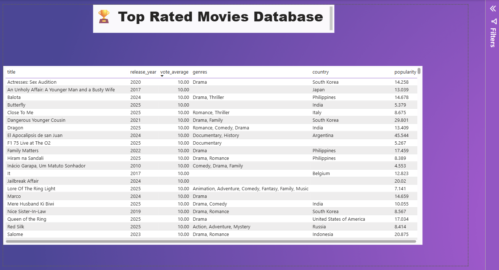

# 🎬 CineInsights: Indian vs Global Movie Trends

An end-to-end data analysis project that cleans, analyzes, and visualizes a 16,000-movie dataset (2010–2025) to compare Indian and global film trends — genre popularity, audience sentiment, and rating patterns — through an interactive Power BI dashboard.

**Built as part of an MCA project.**

---

## 📊 Dashboard Preview

### Overview — Indian vs Global Movie Output


Tracks the volume of Indian vs globally released movies year-over-year, alongside trends in the three most common genres (Drama, Documentary, Comedy).

### Insights — Sentiment & Ratings


Average sentiment polarity by genre (derived from movie descriptions using NLP) compared against average IMDb ratings by release year.

> **Note:** The release-year axis on the ratings chart is unsorted in this build — a known issue from Power BI defaulting to value-based rather than chronological sorting. Noted here intentionally rather than hidden.

### Movie Database — Top Rated Films


A searchable, sortable table of top-rated titles across countries and genres.

---

## 🛠️ Tech Stack

| Stage | Tools |
|---|---|
| Data cleaning & analysis | Python (pandas, NumPy) |
| Sentiment analysis | TextBlob (NLP polarity scoring on movie descriptions) |
| Exploratory visualization | matplotlib, seaborn |
| Interactive dashboard | Power BI Desktop |
| Environment | Jupyter Notebook (VS Code), Python venv |
| Version control | Git / GitHub |

---

## 📁 Project Structure

```
cinesights/
├── netflixmining.ipynb          # Main analysis notebook: cleaning, sentiment, exports
├── CineInsights.pbix            # Power BI dashboard (3 pages)
├── all_movies.csv               # Cleaned full dataset
├── indian_movies.csv            # Filtered: India-tagged titles
├── south_indian_movies.csv      # Filtered: Tamil/Telugu/Malayalam/Kannada titles
├── genre_trends.csv             # Genre counts by release year
├── sentiment_by_genre.csv       # Avg. sentiment polarity per genre
├── movies_per_year.csv          # Indian vs Global movie counts by year
└── netflix_movies_detailed_up_to_2025.csv   # Raw source dataset
```

---

## 🔍 What the Analysis Covers

- **Volume trends** — how Indian movie output compares to global output year-by-year (2010–2025)
- **Genre evolution** — which genres (Drama, Documentary, Comedy, etc.) are growing or shrinking over time
- **Sentiment analysis** — NLP-derived sentiment polarity of movie descriptions, aggregated by genre, to see which genres skew positive (Romance, Family) vs negative (Horror, Thriller)
- **Rating trends** — how average IMDb-style ratings (`vote_average`) shift across release years
- **Top-rated catalog** — a filterable table of the highest-rated titles globally

---

## ⚙️ How It Was Built

1. **Source data**: [Netflix Movies dataset (Kaggle)](https://www.kaggle.com/datasets/shivamb/netflix-shows), extended to 2025, ~16,000 rows
2. **Cleaning**: handled missing values, filtered by country/language for Indian and South Indian subsets, fixed CSV export issues caused by unescaped commas and line breaks in free-text fields (`description`, `title`) using `csv.QUOTE_ALL` and text normalization
3. **Sentiment scoring**: ran each movie's description through TextBlob to get a polarity score (-1 to +1), then aggregated by genre
4. **Export**: cleaned, aggregated subsets exported to CSV specifically shaped for Power BI consumption (pre-grouped where needed, e.g. `genre_trends.csv`, `movies_per_year.csv`)
5. **Dashboard**: built in Power BI Desktop across 3 pages — Overview, Insights, and Movie Database — using clustered column charts, line charts, horizontal bar charts, and a sortable table

---

## 🧩 Known Issues / Honest Notes

- The release-year axis on the **Average Rating by Year** chart (Insights page) is not chronologically sorted — flagged for a future fix using Power BI's "Sort by column" feature with a proper Date table.
- A small number of rows in the raw source dataset have malformed fields (movie descriptions leaking into the `title` column due to scraping artifacts upstream). These were not fully removed, only deprioritized via sorting in the Movie Database table — a full filter/cleanup pass is a planned improvement.
- The `.pbix` file is a binary format and won't render in GitHub's file preview — download it and open in [Power BI Desktop](https://powerbi.microsoft.com/desktop) (free) to interact with it directly, or refer to the screenshots above.

---

## 🚀 Possible Next Steps

- Add a proper Date dimension table for correct chronological sorting
- Clean remaining malformed source rows at the pandas stage rather than masking them in the visual
- Publish the report to Power BI Service for a live, interactive web link
- Add country-level comparison beyond India vs Global (e.g., South Korea, USA breakdowns)

---

## 📄 License

This project uses the [Netflix Movies dataset](https://www.kaggle.com/datasets/shivamb/netflix-shows) from Kaggle for educational/academic purposes.
